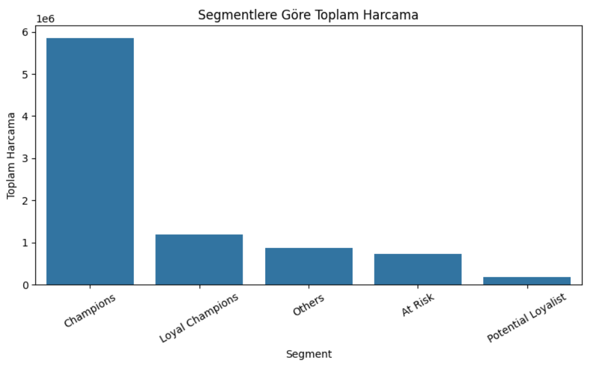
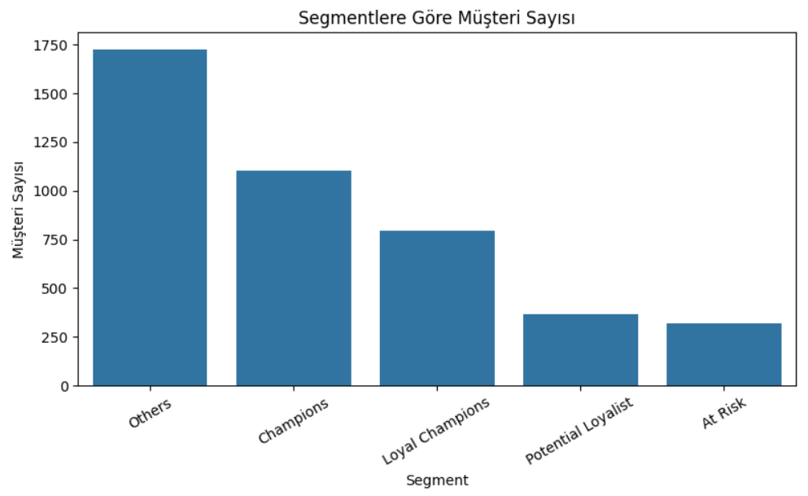
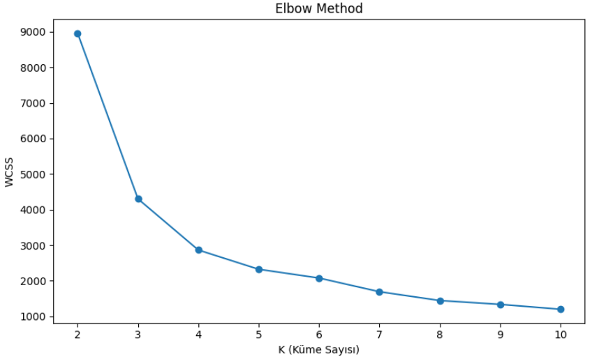

# Online Retail Customer Segmentation

## Why this project matters
Understanding customer behavior is critical for increasing revenue and retention.
This project shows how raw transactional sales data can be transformed into **actionable customer insights** that support better marketing and business decisions.

---

## Project Overview
This project analyzes online retail sales data to understand customer purchasing behavior.
The main goal is to segment customers and provide actionable business insights using **RFM analysis** and **K-Means clustering**.

---

## Dataset
The dataset contains transaction-level sales data including:
- Invoice information
- Product details
- Quantity and price
- Customer ID
- Invoice date

---

## Methods & Workflow
- Data cleaning and preprocessing
- Exploratory Data Analysis (EDA)
- Feature engineering (`TotalPrice`)
- RFM (Recency, Frequency, Monetary) analysis
- Rule-based customer segmentation
- K-Means clustering for advanced segmentation
- Visualization of customer segments and key metrics

---

## 🔍 Key Insights from the Data
- A relatively small group of high-value customers (**Champions**) generates a significant portion of total revenue.
- **At Risk** customers show long recency values, indicating churn risk and the need for re-engagement strategies.
- Customer value differs strongly across segments, highlighting opportunities for targeted marketing and budget optimization.

---

## 📊 Key Visual Results

### Customer Segmentation – Total Spending


### Customer Segmentation – Customer Count


### Product Performance Analysis (Bubble Chart)


### K-Means Elbow Method


---

## Technologies Used
- Python
- Pandas
- NumPy
- Matplotlib
- Seaborn
- Scikit-learn

---

## Project Structure
| File | Description |
|------|------------|
| `eda_rfm.py` | Data cleaning, EDA, and RFM analysis |
| `kmeans_segmentation.py` | K-Means clustering and segment profiling |
| `images/` | Visualization outputs used in the README |
| `data/` | Dataset directory |

---

## 🚀 Quick Start
```bash
git clone https://github.com/berfinerk/online-retail-customer-segmentation.git
cd online-retail-customer-segmentation
pip install -r requirements.txt
python eda_rfm.py
python kmeans_segmentation.py
